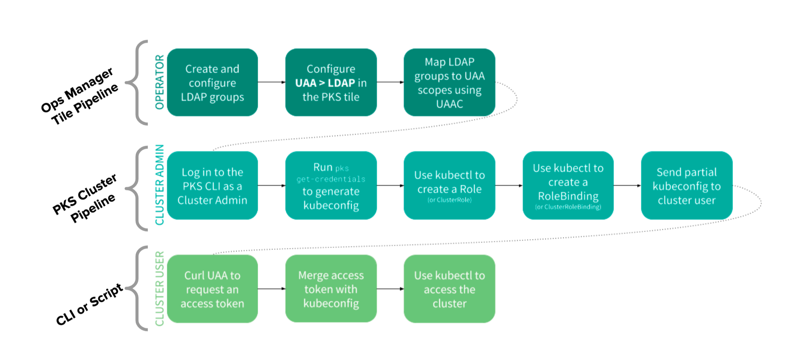
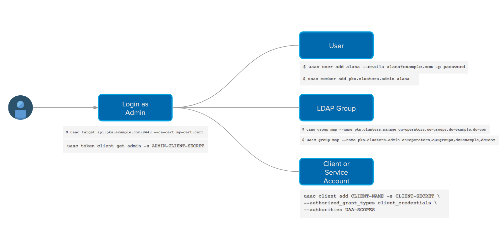
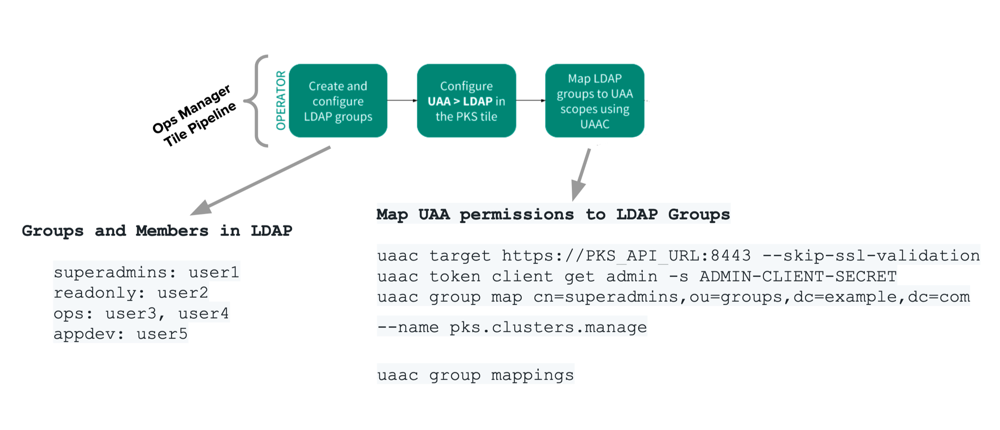
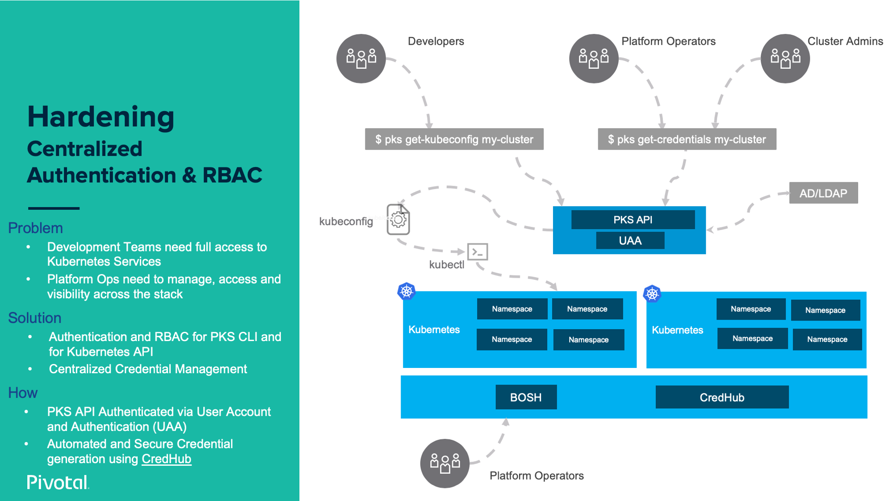
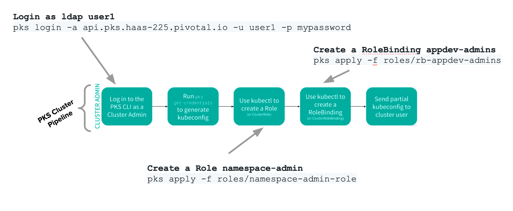
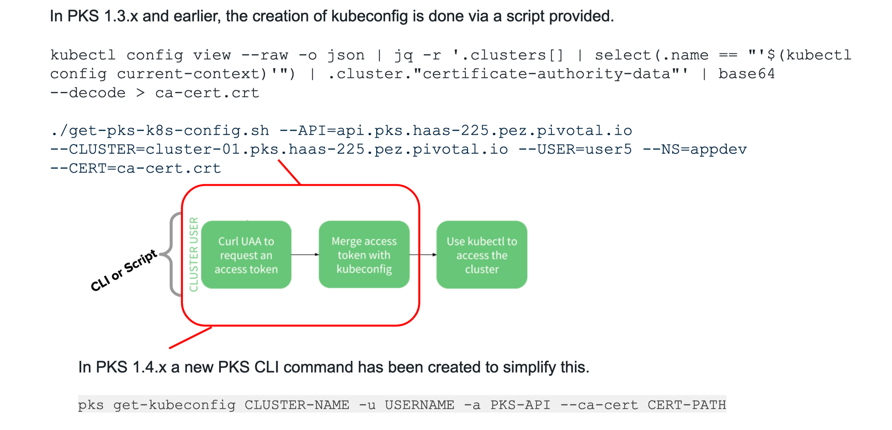
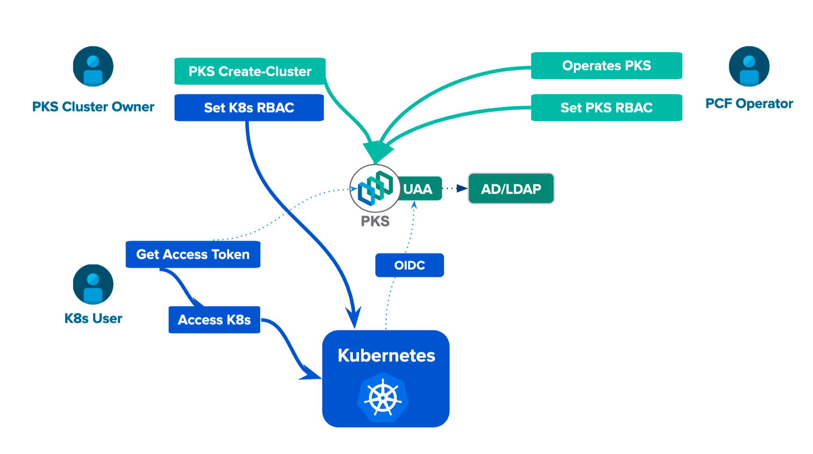

PKS 시스템에는 여러개의 UAA가 탑재되어 있다

BOSH Director 
OpsManager
PKS

참고 URL) 
- PKS LDAP Integration Demo Setup 
https://docs.google.com/document/d/1k404dbI_2A5kkR1SV6pfzXjnqSLNc7ckEd5t_PwK7FI/edit#
- PKS - UAA and LDAP Overview + Demo  
https://docs.google.com/presentation/d/1-sYNnwD4HqIdCYwPByXBRZa-7flsoOEMN5qXbMl-VQQ/edit#slide=id.g58deb23e65_0_3



### pks **UAA** 사용


```bash
$ uaac target api.pks.jhwang.cf:8443 --skip-ssl-validation

$ uaac token client get admin -s <pks_uaa_management_admin_client>
```

사용자 생성
```bash
$ uaac user add user-a -p Pivotal1! --emails user-a@pks.jhwang.cf
$ uaac user add user-b -p Pivotal1! --emails user-b@pks.jhwang.cf
```

사용자 그룹 맴핑
```bash
$ uaac member add pks.clusters.admin user-a 
$ uaac member add pks.clusters.manage user-b
```

만약 외부 LDAP Group에 맵핑하고 싶다면
```bash
$ uaac group map --name pks.clusters.manage <GROUP-DN>
# or
$ uaac group map --name pks.cluster.admin <GROUP-DN>
```

사용자 확인
```bash
$ uaac users
```

### PKS에서 Kubernetes Config 가져오기



사용자 user-a 로 cluster 접속

```bash
$ pks login -a api.pks.jhwang.cf -u user-a -p Pivotal1! -k

API Endpoint: api.pks.jhwang.cf
User: user-a

$ pks get-credentials k8s 

Fetching credentials for cluster k8s.
Password: *********
Context set for cluster k8s.

You can now switch between clusters by using:
$kubectl config use-context <cluster-name>

$ k get pod
NAME                                        READY   STATUS    RESTARTS   AGE
monitoring-prometheus-node-exporter-7dnh9   1/1     Running   0          5d17h
monitoring-prometheus-node-exporter-8s2hh   1/1     Running   0          5d17h
monitoring-prometheus-node-exporter-p2wgv   1/1     Running   0          5d17h
```


사용자 user-b 로 cluster 접속

*편의상 .kube/config삭제*
```bash
$ pks login -a api.pks.jhwang.cf -u user-b -p Pivotal1! -k

$ pks get-kubeconfig k8s -a api.pks.jhwang.cf -u user-b -p Pivotal1! -k

Fetching kubeconfig for cluster k8s and user user-b.
You can now use the kubeconfig for user user-b:
$kubectl config use-context k8s

$ k get pod
Error from server (Forbidden): pods is forbidden: User "user-b" cannot list resource "pods" in API group "" in the namespace "default"
```

user-b에게 권한을 지정한다.

#### PKS API Service : roles
- **pks.clusters.manage**: users with this scope can create and access their own clusters.
- **pks.clusters.admin**: users with this scope can create and access all clusters.

#### Four default types of user roles in K8s
- **cluster-admin:** accounts with this role have super-user access to perform any action on any resource. 
- **admin**: accounts with this role have read/write access to objects in a namespace, including the ability to create roles and rolebindings within the namespace.
- **edit**: accounts with this role have read/write access to objects in a namespace without ability to create roles and rolebindings within the namespace.
- **view**: accounts with this role have read-only access to see objects in a namespace.




### Kubernetes RBAC - Role, RoleBinding

- Create a pod-reader role (user-a)
```bash
$ k apply -f -<<EOF
kind: Role
apiVersion: rbac.authorization.k8s.io/v1
metadata:
    namespace: default
    name: pod-reader
rules:
- apiGroups: [""]
  resources: ["pods"]
  verbs: ["get","watch","list"]
EOF

role.rbac.authorization.k8s.io/pod-reader created
```
하지만, user-b는 아직까지 role binding을 하지 않았기 때문에 "k get pod"시 fobidden 에러가 난다. 

- Assing RBAC configuration to user (user-a)
```bash
$ k apply -f -<<EOF
kind: RoleBinding
apiVersion: rbac.authorization.k8s.io/v1
metadata:
    name: read-pods
    namespace: default
subjects:
-   kind: User
    name: user-b
    apiGroup: rbac.authorization.k8s.io
roleRef:
    kind: Role
    name: pod-reader
    apiGroup: rbac.authorization.k8s.io
EOF

rolebinding.rbac.authorization.k8s.io/read-pods created
```

- RoleBinding을 하기 전과 한 이후를 비교할 수 있다. (user-b)
```bash
ubuntu@jumpbox:~$ k get pod
Error from server (Forbidden): pods is forbidden: User "user-b" cannot list resource "pods" in API group "" in the namespace "default"
ubuntu@jumpbox:~$ k get pod
NAME                                        READY   STATUS    RESTARTS   AGE
monitoring-prometheus-node-exporter-7dnh9   1/1     Running   0          5d17h
monitoring-prometheus-node-exporter-8s2hh   1/1     Running   0          5d17h
monitoring-prometheus-node-exporter-p2wgv   1/1     Running   0          5d17h
```

- 하지만 pod-reader에는 get/watch/list만의 verbs만 가지고 있기 때문에, create는 할 수 없다. 그리고, "node"와 같은 resources를 가지고 올려면 **ClusterRole, ClusterRoleBinding**을 만들어야 한다.

```bash
$ k get nodes
Error from server (Forbidden): nodes is forbidden: User "user-b" cannot list resource "nodes" in API group "" at the cluster scope
```
  - Craete a cluster-role to watch the nodes

```bash
$ k apply -f -<<EOF
kind: ClusterRole
apiVersion: rbac.authorization.k8s.io/v1
metadata:
  namespace: default
  name: node-reader
rules:
- apiGroups: [""]
  resources: ["nodes"]
  verbs: ["get", "list", "watch"]
EOF

clusterrole.rbac.authorization.k8s.io/node-reader created

$ k apply -f -<<EOF
kind: ClusterRoleBinding
apiVersion: rbac.authorization.k8s.io/v1
metadata:
  name: read-nodes
  namespace: default
subjects:
- kind: User
  name: user-b
  apiGroup: rbac.authorization.k8s.io
roleRef:
  kind: ClusterRole
  name: node-reader
  apiGroup: rbac.authorization.k8s.io
EOF

clusterrolebinding.rbac.authorization.k8s.io/read-nodes created


$ k get nodes
Error from server (Forbidden): nodes is forbidden: User "user-b" cannot list resource "nodes" in API group "" at the cluster scope

$ k get nodes
NAME                                      STATUS   ROLES    AGE     VERSION
vm-73178d2e-b770-49c1-4a80-a876e1bc31aa   Ready    <none>   5d22h   v1.13.5
vm-a3c68b6c-10ff-4c54-50c4-ab1a7247850a   Ready    <none>   5d22h   v1.13.5
vm-f80dd20b-aaa3-4598-76c3-db21ead87899   Ready    <none>   5d22h   v1.13.5

```

